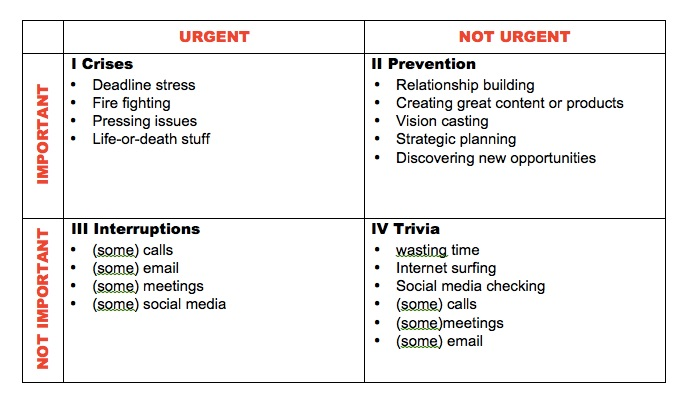

# refx craftsman in the cubicle

Treat your work as craft: focus intently on developing a small number of valuable skills, then leverage these valuable skills to push your career in a direction meaningful to you.

This mission will require:

1. **logistical changes:**   how I structure my day or manage organizational obligations
1. **skill changes:** how I integrate deliberate practice into my work.

[Main link][]

[Main link]:	http://calnewport.com/blog/?s=%23craftsmanincubicle

## shutdown routines

The goal is to adopt a habit of specifying time (and space) where you are not working.  Not only creating this time off, but convincing yourself that it is justified and not to spend the entire time fretting over it.

However, you will have the urge to ruminate.  The key point is not to ignore the urge — which rarely works — but not to engage the specifics of the rumination — which tends to make things worse.  In less than month, the urge to ruminate on these issues had reduced to become essentially non-existent. 

Specifics to this routine:

- __have a plan for the next day__ / rest of week written out the night before
- __avoid checking information__ (email, social media) in the morning
- __not having easy access to distractions__, either on devices or laptops.
  either disconnect distracting services, or don't leave them open on desks
- __commiting to a dedicated meditation zone.__  have some activity that
  requires total concentration immediately after finishing work.  one non-work thought, or podcast or book (or, preferable, physical activity)

Study Hacks: 

- [Work less Work better][WlWb]

[WlWb]: http://calnewport.com/blog/2012/08/02/work-less-to-work-better-my-experiments-with-shutdown-routines/

## textbook method

There are structured and unstructured ways to acquire information. One example of structured acquisition is to write a mini-textbook about the subject you are investigating.  

The process prevents you from mindlessly consuming and making judgements on the information you are reviewing.  You discard the inessential up front and don't have it cloud you.

It is also beneficial because you can reuse it later, opposed to random ideas not recorded well.

This is one piece of an ultra-learning philosophy:

- to rapidly acquire and synthesize information
- to rapdily develop mastery of techniques based on that information
- using those techniques in a number of domains 

Don't focus on solving problems, instead develop the ability to master things that are damn hard, damn quick.

Study Hacks: 

- [Textbook method][TBM]
- [Textbook method experiments][TBMe]
- [What you know matters more than what you do][WhatYouKnow]

[TBM]:  http://calnewport.com/blog/2012/08/10/you-know-what-you-write-the-textbook-method-for-ultra-learning/
[TBMe]: http://calnewport.com/blog/2012/08/16/experiments-with-the-textbook-method/
[WhatYouKnow]:  http://calnewport.com/blog/2012/06/12/what-you-know-matters-more-than-what-you-do/

## working less than you assume

Knowledge Work consists of the following:

- **core tasks:** The tasks that define how good you are at your job.
- **periphery tasks:** The tasks to keep your job, but don't affect your standing in your field.

The amount of time you spend on core tasks is probably very small.

It is very easy (especially for me) to be consumed by urgent tasks that are clearly in the periphery.  This relates a lot to Steven Covey's time management matrix:

where tasks have 1 of each of the 2 following attributes:

- important (core) / unimportant (periphery)
- urgent / not urgent

Worse yet, I assign much of this urgency myself.  There's no deadline (or often a need at all). The impulse / obsessive tendencies of my ADHD make it a constant battle to focus on the important work.

Conversely, as long as you have a system in place to let you completely focus, the number of hours doesn't have to be high.  It's more important to develop the quality of concentration and freedom from distraction.

Study hacks:

- [You probably work less than you think][WorkLess]
- [Henri Poincare's 4-hour day][Poincare]
- [How I spend 42 hours on the most critical activity][42Hours]

[WorkLess]:http://calnewport.com/blog/2012/08/23/you-probably-really-work-way-less-than-you-assume/
[Poincare]:http://calnewport.com/blog/2012/08/31/henri-poincares-four-hour-work-day/
[42Hours]:    http://calnewport.com/blog/2011/05/10/lab-notes-i-spent-42-hours-last-month-on-the-activity-most-critical-to-my-success/

## producing creative insights

Sidenote:

>   Avoid trying to understand why the complicated solution worked by 
>   instead turning attention to understanding why simpler strategies failed.
>   I’m surprised by how often the study of things that break lead to simple 
>   things that don’t.

The setting for your work is as important as your methods. Excellent progress can be made my changing your surroundings.

The motivation for adventure studying was two-fold:

- Changing your context makes the work seem fresh and allows you to tackle 
  it with new creativity and energy.
- Going somewhere exotic separates you from common distraction urges.

You should always ask yourself:

- when am I going to study;
- for how long;
- with what strategies; and
- in what (epic) context…

Studyhacks: 

- [Adventure method][AdventureMethod]
- [Adventure studying][AdventureStudy]

[AdventureMethod]:http://calnewport.com/blog/2012/09/05/solutions-beyond-the-screen-the-adventure-work-method-for-producing-creative-insights/
[AdventureStudy]:   http://calnewport.com/blog/2009/12/02/heidegger-with-hefeweizen-rethinking-the-power-of-context/

## auditing your work habits

_New important results almost always require expert-level knowledge of existing important results._  I should be spending a significant portion of my time reading and trying to understand the best work in my field.

2 kinds of research projects:

- **existing projects,** referencing and building upon existing results
- **speculative projects,** novel ideas effectively being invented

He has a tendency towards novel projects, because they don't demand the same depth of understanding as existing projects.  This is less applicable to my current circumstances, but we should all regularly perform audits where we ask ourselves how we are currently spending our work time and how we should be spending this time.

Study hacks:

- [Auditing your habits][Auditing]

[Auditing]:http://calnewport.com/blog/2012/10/11/the-importance-of-auditing-your-work-habits/