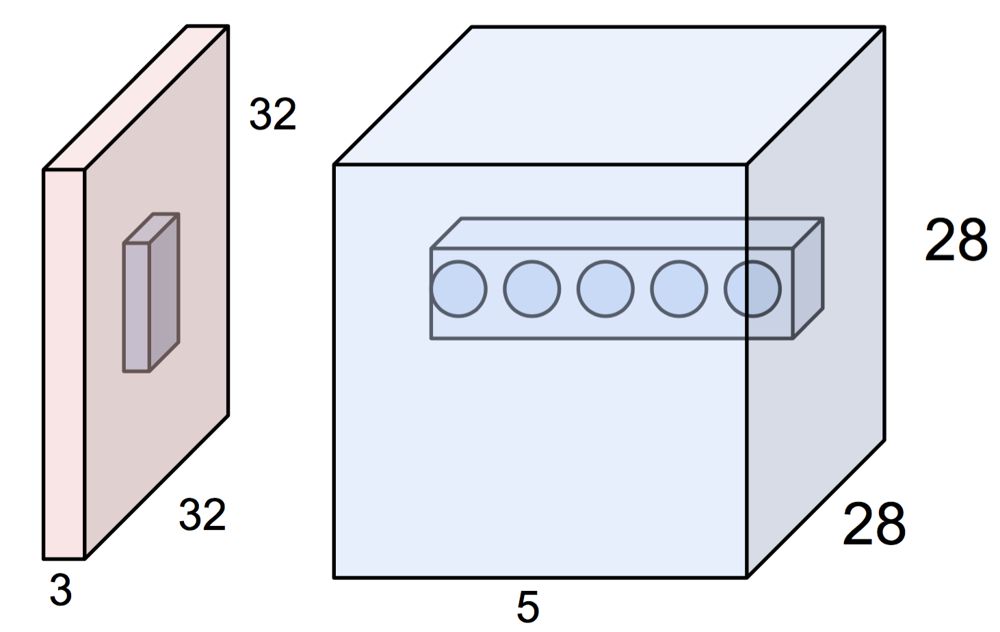
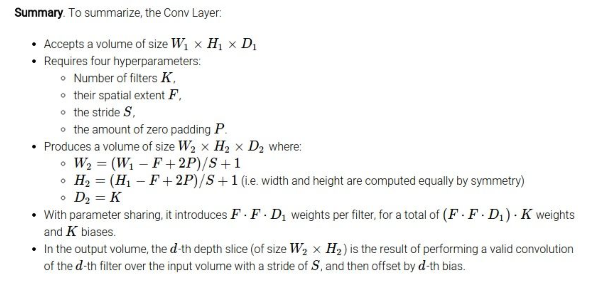

# fast.ai deep learning course 1

## todo list

See `03-state-farm-sample.ipynb`.

- [x] redo dataset with different drivers split across train/validation sets
- [x] linear model
- [x] single hidden dense later
- [x] Basic VGG-style CNN
- [x] data augmentation
- [x] data augmentation + batchnorm
- [ ] find optimal data augmentation, then precompute 10x samples with that applied
      - can this viably fit in memory?
- [ ] batchnorm + dropout
- [ ] imagenet vgg layers + fc layers with batchnorm & dropout
- [ ] [insert batchnorm into imagenet vgg layers](https://github.com/fastai/courses/blob/master/deeplearning1/nbs/imagenet_batchnorm.ipynb) + batchnorm + dropout
- [ ] use pseudo-labelled test data to improve predictions
- [ ] convert all examples to keras functional api
- [ ] switch to fish detection challenge
- [ ] add bounding box prediction
- [ ] convert all examples to pytorch
- [ ] variational weights for model compression

## week 1 image recognition

### launching AWS instances

- I've got a bunch of work done on this already
- setting up instances, easily managing their state, connecting to them and getting results back/forth
- https://github.com/matttrent/aws-deeplearn
- https://github.com/matttrent/tilde-bin
- https://github.com/matttrent/dotfiles

### fine-tuning

basic gist

- adapt an already-trained model weights/architecture for a different task
- remove last layer of the NN, replace with a layer that matches the output of the new task
- freeze all other layers of the NN, and retrain the weights of new last layer
- assumes the data of the new task is similar to that of the original architecture

can further finetune more layers of the network, than just the last

- as long as new task data matches old task data can keep existing CNN layers
- if finetuning more than last layer, best to first finetune the last layer only before finetuning more
- NOTE: why is this?

why this is powerful

- can leverage much larger datasets, provided they share some similarities with the data we're using for our task
- task does not need to match, as long as training/test inputs share similarities
- can use the generalization from a network only usable with a very large training set, and apply to problems with small amounts of data

### supporting material

- http://wiki.fast.ai/index.php/Lesson_1_Timeline


- http://wiki.fast.ai/index.php/Lesson_1
  - https://github.com/fastai/courses/blob/master/deeplearning1/nbs/lesson1.ipynb
- http://wiki.fast.ai/index.php/Lesson_1_Notes

## week 2 CNNs

### dataset orginization

1. organize dataset into `train` and `test` folders
2. create a `valid` folder and move 2000 random samples from the train folder, into it
3. make a separate `dataset-sample` 
   1. create a `train` folder and copy 1500 random samples to it from main `train` folder
   2. create a `valid` folder and copy 50 random samples to it from main `valid` folder

### my preferred project organization

code

- one module `fastai`
  - contains many shared helper functions
  - submodule per dataset/project to contain all common code for that project
- `notebooks`
  - hacking on small projects that aren't worth configuring the full script setup for
  - but ideally as infrastructure advances it becomes easier to spinup new things
- `scripts`
  - multiple training scripts + 1 generic test script, per project
  - one train script per model possible architecture, can be many
  - all hyperparameters are arguments to script
  - each script run logs all its info to a standardized directory format
  - test script reads output of previous training script, validates against test set, possible submits to kaggle

```
- fastai
    - fastai
        - kaggle.py
        - utils.py
        - dataset-project
            - etc.py...
- scripts
    - dataset-train-xxx.py
    - dataset-test.py
```

`~/data`

- one `dataset` sub-directory per dataset
- have a separate `dataset-sample` directory that mirrors the structure of the full dataset, but contains 1500 training images and 1000 validation

`~/runs`

- one `dataset` sub-directory per dataset
- one run folder per test or train script run
- formatted like `YYYYMMDDHHMM-scriptname-p1-p2-p3-p4` where p1-p4 are config values for that script
- contains yaml file of all configuration values for that script, so can be rerun
- contains saved models for that run, training log, and validation results

### stochastic gradient decent

- cs231n [Optimization: Stochastic Gradient Descent](https://cs231n.github.io/optimization-1/)
- cs231n [Backpropagation, Intuitions](https://cs231n.github.io/optimization-2/)
- want the highest learning rate you can get away with
- want to reduce learning rate after a few epochs
- in practice, deep learning does not have local minima.  with 100-million parameters, it's effectively impossible to find a point that no dimension can't be improved up

### neural network architecture

- cs231n [Neural Networks Part 1: Setting up the Architecture](https://cs231n.github.io/neural-networks-1/)

dense layers

- every neuro has a weight for every entry in the previous layer, plus a shared bias term
- so, each neuron computes a dot-product between the weights and the previous layer's neurons + bias
- effectively, matrix-multiplication, when considering all neurons in a layer

activation layers

- a dense NN is represented as a series of matrix multiplications
- however, that doesn't contain much predictive power
- series of matrix multiplications can still be represented by a single linear transform
- so include various non-linear activation functions to transform the output of each dense layer to prevent it from collapsing to a single linear transform
- for most layers, ReLU is standard
- for the last layer, the activation layer is dependent on the score function
  - in the case of classification, softmax

convolution layers & max pooling

- a max pooling layer reduces the dimensionality of images (resolution) by reducing the number of pixels in the image
- it does so by replacing an entire NxN area of the input image with the maximum pixel value in that area.
- doing 7x7 max pooling, on a 28x28 image, results in a 4x4 image

###  linear models in keras

- training linear model via SGD

```python
# init data
x = random((30,2))
y = np.dot(x, [2., 3.]) + 1.

# create and compile single layer linear model
lm = Sequential([ 
  Dense(1, input_shape=(2,))
])
lm.compile(optimizer=SGD(lr=0.1), loss='mse')

# fit data
lm.fit(x, y, nb_epoch=5, batch_size=1)

# some low number since mse between y and y' will be small
lm.evaluate(x, y, verbose=0)
```

### storing inputs and outputs of models

```python
import bcolz
def save_array(fname, arr):
  	c = bcolz.carray(arr, rootdir=fname, mode='w')
    c.flush()

def load_array(fname): 
  	return bcolz.open(fname)[:]
  
# get the data and save to arrays
val_data = get_data(path+'valid')
trn_data = get_data(path+'train')

save_array(model_path+'train_data.bc', trn_data)
save_array(model_path+'valid_data.bc', val_data)

# load train/valid data from bcolz if you want
trn_data = load_array(model_path+'train_data.bc')
val_data = load_array(model_path+'valid_data.bc')

from vgg16 import Vgg16
vgg = Vgg16()
model = vgg.model

trn_features = model.predict(trn_data, batch_size=batch_size)
val_features = model.predict(val_data, batch_size=batch_size)

save_array(model_path+'train_lastlayer_features.bc', trn_features)
save_array(model_path+'valid_lastlayer_features.bc', val_features)
```

### training a linear model on the feature outputs from imagenet model

- not even fine-tuning
- training a linear model on the imagenet class predictions from VGG

```python
# keras returns class ids, so we one-hot encode them
def onehot(x): 
  	return np.array(OneHotEncoder().fit_transform(x.reshape(-1,1)).todense())

# Use batch size of 1 since we're just doing preprocessing on the CPU
val_batches = get_batches(path+'valid', shuffle=False, batch_size=1)
batches = get_batches(path+'train', shuffle=False, batch_size=1)

# load the features that will be our training data
trn_features = load_array(model_path+'train_lastlayer_features.bc')
val_features = load_array(model_path+'valid_lastlayer_features.bc')

# get one-hot encoded labels for keras
val_classes = val_batches.classes
trn_classes = batches.classes
val_labels = onehot(val_classes)
trn_labels = onehot(trn_classes)

# define and compile model
lm = Sequential([
  	Dense(2, activation='softmax', input_shape=(1000,))
])
lm.compile(
  optimizer=RMSprop(lr=0.1), 
  loss='categorical_crossentropy', 
  metrics=['accuracy']
)

# train
lm.fit(trn_features, trn_labels, nb_epoch=3, batch_size=batch_size, 
       validation_data=(val_features, val_labels))
```

### visualization of results

It's often a good idea to analyze how well your model is doing through visualization. Fortunately, since we're dealing with images this is exceptionally easy. We'd like to look at the following examples:

1. A few correct labels at random
2. A few incorrect labels at random
3. The most correct labels of each class
4. The most incorrect labels of each class
5. The most uncertain labels (those with probabilities near 0.5)

### kaggle submission

- be sure to pay attention to the specifics of the how kaggle evaluates your submission
- different contests can have completely different evaluation metrics, make sure you understand the nuance of them.
- e.g. log loss rewards predictions that are confident and correct (p=.9999,label=1), but it punishes predictions that are confident and wrong far more (p=.0001,label=1). 
- In Jeremy's case, he got 97% accuracy on his validation set, so conservatively chose a 90% confidence and he rounded down his edge predictions, and swap all ones with .95 and all zeros with .05.

### supporting material

- http://wiki.fast.ai/index.php/Lesson_2_Timeline
- http://wiki.fast.ai/index.php/Lesson_2
  - https://github.com/fastai/courses/blob/master/deeplearning1/nbs/lesson2.ipynb
  - https://github.com/fastai/courses/blob/master/deeplearning1/nbs/dogs_cats_redux.ipynb
- http://wiki.fast.ai/index.php/Lesson_2_Notes


## week 3 over-fitting

### neural network architecture

- cs231n [Convolutional Neural Networks: Architectures, Convolution / Pooling Layers](https://cs231n.github.io/convolutional-networks/)
- cs231n [Understanding and Visualizing Convolutional Neural Networks](https://cs231n.github.io/understanding-cnn/)
- https://colah.github.io/posts/2014-07-Understanding-Convolutions/

convolutional layers

- **TODO** complete this explanation





softmax activation

- defined as $e^{x_i} / \sum e^{x_i}$
- final layer output is probabilities, should sum to 1
- final layer output is one-hot encoded, so 1 should be large and rest small
- softmax accomplishes both of that
- in general, want to construct activation layers that make it as convenient as possible for the network accomplish the thing we want

### underfitting and overfitting

underfitting

- using a model that's not complex or powerful enough for your task (not enough parameters)
- if our training error is much lower than our validation error then we're underfitting

overfitting

- a model with too many parameters, trained for too long, that has learned what your specific training data is instead of the  
- training set has a much higher accuracy than your validation set
- perhaps the single most important concept in machine learning

application to class examples

- example models are underfitting, because of dropout (in this case set to 0.5)
  - in this case because our cats & dogs task is not as complex as the imagenet task
- the dropout layers throw away half the inputs, so it's very difficult to learn the specific examples to overfit
- can train big complex models for long periods of time without overfitting

This is the order that we recommend using for reducing overfitting (more details about each in a moment):

1. Add more data
2. Use data augmentation
3. Use architectures that generalize well
4. Add regularization (dropout, L1-, L2- regularization)
5. Reduce architecture complexity.

### data augmentation

- never a reason not to do data augmentation
- only a question of what and how much
- use `keras` generator

### batch normalization

- something else you should always do
- in machine learning you always want to normalize your inputs
  - data to have mean=0 & std=1, so weights have normalized gradients
- Adding batchnorm to a model can result in **10x or more improvements in training speed**
- Because normalization greatly reduces the ability of a small number of outlying inputs to over-influence the training, it also tends to **reduce overfitting**.
- In addition to normalizing weights, batchnorm takes two additional steps:
  1. Add two more trainable parameters to each layer - one to multiply all activations to set an arbitrary standard deviation, and one to add to all activations to set an arbitary mean
  2. Incorporate both the normalization, and the learnt multiply/add parameters, into the gradient calculations during backprop.
- This ensures that the weights don't tend to push very high or very low (since the normalization is included in the gradient calculations, so the updates are aware of the normalization). 
- But it also ensures that if a layer does need to change the overall mean or standard deviation in order to match the output scale, it can do so.

### model manipulation

In this notebook, we experiment with splitting VGG into to convolutional and fully connected layers to accelerate the fine-tuning process.  When fine-tuning, we generally don't alter the convolutional layers.  They've been learned from very large datasets and tend to be tuned to the distribution of image content (to some degree more or less depending on the distribution of data and labels -- ala the Imagenet tendency towards dog faces).

The reason for this approach is that most of the computational work is in the convolutional layers.  Since they tend not to change in most experiments (the computational cost of training them anew to convergence is too high), we can precompute them.  Then we can construct a second network that takes the output of the convolution-only network as input and can iterate much more rapidly on that.

We're going to:

- construct a conventional VGG model
- split it at the division between the convolutional layers and the FC layers
- split at last expensive layer, leaving any max-pool or flattening in the FC part, so you can experiment with
- we'll take our entire dataset and run it through the convolutional layers, and store the result
- we'll then construct a secondary model that takes the convolutional output for input, and outputs the desired prediction
- we'll then train that network on the stored convolutional output

This way we can reduce a 10+ minute training per epoch to 22 seconds.

See `03-vgg-split.ipynb`.

1. take VGG model
2. separate into convolutional and fully connected (+ dropout) layers
3. create new convolution-only model, precompute output and save
4. create new full-connected model with dropout=0
5. transfer weights from old dropout model
6. finetune new fc model

### end to end process notes

This notebook shows a lot of exploratory work with the State Farm kaggle challenge.  The biggest takeaways are:

1. Find the smallest sample size that produces consistent results
   1. try different sizes, computing validation accuracy over 10 random batches
   2. take smallest set with sufficiently small variation between accuracies
2. Start with very small models and quickly work up in complexity, till you're overfitting
3. Selecting the initial training rate, and adjusting it through training is really important
   1. with a very small value for 1-2 epochs, jump back up, then slowly drop again
4. Get familiar with data augmentation, but remember you can't precompute your convolutional layers
5. Dropout is super important, but the value is dependent on your training set size, so you need to relearn it after you finish with the sample set
6. Ask "is this really a good idea, is this a waste of time?"

notes

- in all cases, train for 1 epoch at default LR, then 0.1 LR, then 0.01 LR, etc...
- all experiments except last can be performed on sample data
- dropout regularization must be tuned to the full dataset
- see https://github.com/fastai/courses/blob/master/deeplearning1/nbs/mnist.ipynb

### what needs to change between different approachs

using a subset of the training data

- moderately faster
- allows one to data augmentation
- requires refinding dropout probabilities when scaling to final dataset

precomputing convolutional layers

- much faster
- precomuptation prevents use of data augmentation
- can compromise constructing a larger data set where each image has a random data augmentation applied
- say augmented data set is 10x larger with 10 copies of each image with random augmentations

full dataset, full model

- most versatile, most representative of final problem
- by far the slowest

### Insights from Jeremy's Approach to Kaggle's Statefarm Competition

In lesson 4, we go over Jeremy's entry to the Statefarm Distracted Driver Detection competition. Here we discuss some insights revealed in his submission.

#### Testing on Samples

By this point, we've mentioned several hyperparameters such as dropout rate and learning rate. Loosely speaking, a **hyperparameter** is a parameter used in a model that is not modified through training; rather it is chosen *a priori* and modified by the user to optimize the desired outcome.

As mentioned before, it is good practice to tune hyperparameters and modify architectures on a random sample set of the overall training data, as this reduces computational time drastically. Fortunately, we typically find that our sample set is general enough to ensure that the tuning and design choices made on the sample set work well on the entire set.  

**NOTE:** watch for overlap of classes between test and validation set. Model can appear to generalize more than it does.

#### Input Batch Normalization

As discussed last lesson, it's good practice to always normalize our inputs. Instead of manually calculating averages and variances across the entire training set, a much simply approach is to start your Keras model with a Batch Normalization layer. This will handle the input normalization for you, and is a good default starting point.

#### Linear Model

We start with a simply linear model in Keras to see how we might tune hyperparameters in practice.

Upon compiling and fitting, we find that our training and validation accuracies are very low. While we would not expect a linear model to perform as well as typical architectures, here are still over a million parameters so we do expect some performance. Therefore, underfitting is likely not the problem

A more likely reason is that the learning rate is too high, and we jump too far at the start of training.

Often times, there are reasonable solutions to our optimization problem that are very easy to find. For example, in the Statefarm competition we try to classify each picture into one of ten classes. A plausible solution is for our model to simply predict the same class every time. But of course this isn't a minimum we're interested in.

The solution to avoid this is to start with a very low learning rate to avoid jumping to an undesirable minimum, and then increase once we're no longer at risk of getting stuck there.

#### Architectures

It's also useful to test the effectiveness of different architectures and data augmentation techniques on a sample. With Statefarm, we employ a CNN for image recognition, and in the lecture we see how even a very simple CNN can get a validation accuracy of 67%.

#### Tuning Data Augmentation

To date, there is no rigorous approach to finding optimum parameters for data augmentation. We recommend scanning values for data augmentation techniques separately, selecting those that produce the best results upon implementation, and combining them. This tuning can easily be done on a sample.

#### Regularization

Regularization, however, cannot be tuned on a sample. Recall that regularization attempts to prevent overfitting by attempting to make our network generalizable in training. Necessarily, a small sample will need more regularization to generalize to unseen data than a large training set, because the training set will necessarily contain more of the variation inherent in the population.

**NOTE:** Is there some principled way of guessing change in regularization (ala dropout probability) going from one sample size to another?  Problem-specific but any best practices?

### supporting material

- http://wiki.fast.ai/index.php/Lesson_3_Video_Timeline
- http://wiki.fast.ai/index.php/Lesson_3
  - https://github.com/fastai/courses/blob/master/deeplearning1/nbs/lesson3.ipynb
  - https://colah.github.io/posts/2015-08-Backprop/
  - http://wiki.fast.ai/index.php/Gradient_Descent#Stochastic_Gradient_Descent
  - cs231n [Neural Networks Part 2: Setting up the Data and the Loss](https://cs231n.github.io/neural-networks-2/)
    - NOTE: why is it called log-loss some places and binary/categorical entropy others?
  - cs231n [Neural Networks Part 3: Learning and Evaluation](https://cs231n.github.io/neural-networks-3/)
- http://wiki.fast.ai/index.php/Lesson_3_Notes


## week 4 collaborative filtering and embeddings

### Optimizers and learning rate

The rate at which we update parameters through gradient descent is determined by the **learning rate**. This can be thought of as the size of the "step" we take down the gradient in the hypersurface defined by our loss function. In general, standard and stochastic gradient descent employs a constant learning rate. However, this can cause a number of issues during training:

- If the learning rate is too small, the optimisation will need to be longer than may be necessary. In terms of step size, a small learning rate means our steps our too small and we may never reach a feasible optimum in reasonable time.
- If the learning rate is too big then the optimisation may be unstable. In terms of step size, this means are steps may be too large, and we might step over potential optimums or even bounce out of an optimum.
- The optimisation may get stuck in an unsatisfactory local minima, or other challenging areas like a saddle point.

The learning rate can be manually adjusted throughout the training process to improve performance, but this is a very ad-hoc methodology that doesn't really use any of the information gained during the learning process. A better approach is to use some of the information about the loss function we're optimizing during training, and modify our learning rate to reflect that.

#### Momentum

For NN's, the hypersurface defined by our loss function often includes **saddle points**. These are areas where the gradient of the loss function often becomes very small in one or more axes, but there is no minima present. When the gradient is very small, this necessarily slows the gradient descent process down; this is of course what we desire when approaching a minima, but is detrimental otherwise. Momentum is intended to help speed the optimisation process through cases like this, to avoid getting stuck in these "shallow valleys".

Momentum works by adding a new term to the update function, in addition to the gradient term. The added term can be thought of as the average of the previous gradients. Thus if the previous gradients were zig zagging through a saddle point, their average will be along the valley of the saddle point. Therefore, when we update our weights, we first move opposite the gradient. Then, we also move in the direction of the average of our last few gradients. This allows us to mitigate zig-zagging through valleys by forcing us along the average direction we're zig-zagging towards.

#### Dynamic Learning Rates

Momentum does well at decreasing optimization time for some parameters overall, but we still often find that certain parameters can take along time. A better approach is to dynamically adjust the learning rate factor for each parameter, utilizing information gained from the optimization process.

#### Adagrad

Traditionally the learning rate is constant for all parameters in the model. Adagrad is a technique that adjusts the learning rate for each individual parameter, based on the previous gradients for that parameter. Essentially, the idea is that if previous gradients were large, the new learning rate will be small, and vice versa.

The implementation looks at the gradients that were previously calculated for a parameter, then squares all of these gradients (which ignores the sign and only considers the magnitude), adds all of the squares together, and then takes the square root (otherwise known as the l2-norm). For the next epoch, the learning rate for this parameter is the overall learning rate divided by the l2-norm of prior updates. Therefore, if the l2-norm is large, the learning rate will be small; if it is small, the learning rate will be large.

Conceptually, this is a good idea. We know that typically, we want to our step sizes to be small when approaching minima. When they're too large, we run the risk of bouncing out of minima. However there is no way for us to easily tell when we're in a possible minima or not, so it's difficult to recognize this situation and adjust accordingly. Adagrad attempts to do this by operating under the assumption that the larger the distance a parameter has traveled through optimization, the more likely it is to be near a minima; therefore, as the parameter covers larger distances, let's decrease that parameter's learning rate to make it more sensitive. That is the purpose of scaling the learning rate by the inverse of the l2-norm of that parameter's prior gradients.

The one downfall to this assumption is that we may not actually have reached a minima by the time the learning rate is scaled appropriately. The l2-norm is always increasing, thus the learning rate is always decreasing. Because of this the training will reach a point where a given parameter can only ever be updated by a tiny amount, effectively meaning that parameter can no longer learn any further. This may or may not occur at an optimal range of values for that parameter.

Additionally, when updating millions of parameters, it becomes expensive to keep track of every gradient calculated in training, and then calculating the norm.

#### RMSProp

RMSPRop is very similar to Adagrad, with the aim of resolving Adagrad’s primary limitation. Adagrad will continually shrink the learning rate for a given parameter (effectively stopping training on that parameter eventually). RMSProp however is able to shrink or increase the learning rate.

RMSProp will divide the overall learning rate by the square root of the sum of squares of the previous update gradients for a given parameter (as is done in Adagrad). The difference is that RMSProp doesn’t weight all of the previous update gradients equally, it uses an exponentially weighted moving average of the previous update gradients. This means that older values contribute less than newer values. This allows it to jump around the optimum without getting further and further away.

Further, it allows us to account for changes in the hypersurface as we travel down the gradient, and adjust learning rate accordingly. If our parameter is stuck in a shallow plain, we'd expect it's recent gradients to be small, and therefore RMSProp increases our learning rate to push through it. Likewise, when we quickly descend a steep valley, RMSProp lowers the learning rate to avoid popping out of the minima.

#### Adam & Eve

Adam (Adaptive Moment Estimation) combines the benefits of momentum with the benefits of RMSProp. Momentum is looking at the moving average of the gradient, and continues to adjust a parameter in that direction. RMSProp looks at the weighted moving average of the square of the gradients; this is essentially the recent variance in the parameter, and RMSProp shrinks the learning rate proportionally. Adam does both of these things - it multiplies the learning rate by the momentum, but also divides by a factor related to the variance.

**NOTE:** Jeremy uses Adam for all his work at this point.

Eve is an extension of Adam that also keeps track of the change in loss function, and incorporates this difference into the learning rate. You can peruse the details [[here](https://arxiv.org/pdf/1611.01505v2.pdf)], but essentially Eve increases the learning rate when there is little to no change in the loss function, and decreases it when the loss function fluctuates.

This can be helpful: when the loss function is barely changing, it could be indicative of being stuck in a shallow plain in the hypersurface, and increasing the learning rate may push us through it. Like wise, if the loss function is fluctuating wildly, it could mean that we're bouncing around a minima, and we should decrease the learning rate.

However, there's an obvious flaw in Eve; when we approach a minimum, we expect the loss function to stop changing. In this scenario, Eve wants to increase the learning rate, which can bounce us out of our minimum.

### pseudo-labelling

- [psuedo-labeling](http://deeplearning.net/wp-content/uploads/2013/03/pseudo_label_final.pdf) is a simple approach to utilizing unlabelled data is known.  also look at [knowledge distillation](https://arxiv.org/abs/1503.02531).
- suppose we have a model that has been trained on labelled data, and the model produces reasonably good validation metrics.
- can simply use this model then to make predictions on all of our unlabelled data, and then use those predictions as labels themselves. 
- this works because while we know that our predictions are not the true labels, we have reason to suspect that they are fairly accurate. Thus, if we now train on our labelled and psuedo-labeled data we can build a more powerful model by utilizing the information in the previously unlabelled data to better learn the general structure.
- One parameter to be mindful of in psuedo-labeling is the proportion of true labels and psuedo-labels in each batch. We want our psuedo-labels to enhance our understanding of the general structure by extending our existing knowledge of it. If we allow our batches to consist entirely of psuedo-labeled inputs, then our batch is no longer a valid representation of the true structure. 
- The general rule of thumb is to have 1/4-1/3 of your batches be psuedo-labeled.

### collaborative filtering

- latent factor analysis by gradient descent
- find unobserved factors for both user and movie (or similar), esplain the observed ratings matrix
- implement in eras

### supporting material

- http://wiki.fast.ai/index.php/Lesson_4_Timeline
- http://wiki.fast.ai/index.php/Lesson_4
  - https://github.com/fastai/courses/blob/master/deeplearning1/nbs/statefarm-sample.ipynb
  - https://github.com/fastai/courses/blob/master/deeplearning1/nbs/statefarm.ipynb
  - https://github.com/fastai/courses/blob/master/deeplearning1/nbs/lesson4.ipynb
  - http://ruder.io/optimizing-gradient-descent/
- http://wiki.fast.ai/index.php/Lesson_4_Notes

## week 5 intro to NLP and RNNs

### adding batch normalization to existing network

- As a reminder, batch normalization has become something of a standard now because it increases training speed and tends to reduce overfitting. This makes it desirable in any CNN architecture, as it lets us avoid relying too heavily on dropout to reduce overfitting; this is a good thing because dropout is a loss of data, which is always best to mitigate.
- Recall that batch normalization works by first normalizing the output of a previous activation layer by subtracting from each output the batch mean and dividing by the batch standard deviation. Next, the normalized outputs are "denormalized" by multiplying by a "standard deviation" parameter (gamma) and adding a "mean" parameter (beta). In other words, the normalized outputs are scaled and shifted by trainable parameters. This allows us to normalize the activations to increase the stability of the neural network, while allowing gradient descent to undo this normalization in a way that minimizes our loss function.

- all we need to do is insert a batchnorm layer
- figure out the mean and standard deviations of the incoming dataset
- set the batchnorm weights to the mean and std of the dataset
- that way it preserves the distribution but can do batchnorm
- can use higher learning rates

Frequently throughout this course we have fine-tuned the pre-trained VGG 16 model to do various image classification tasks with great success. However, VGG lacks batch normalization, because at the time it was created batch normalization didn't exist. Therefore, it's reasonable to ask whether or not we can improve VGG's performance by updating it's architecture to include batch normalization.

Let's now consider the challenge in introducing batch normalization to a pre-trained network like VGG. Consider that in consecutive layers, the weights are trained to be optimal given the output of the prior activation layer. Therefore, if we normalize the activation outputs and shift/scale by some randomly initialized parameters, the weights in the next layer are no longer the optimal transformation for these new inputs. This disruption will cause chaos in gradient descent, and it would take a considerable amount of training to get back to an optimal state, which nullifies the purpose of using a pre-trained network.

The solution is quite simple; we should initialize the scaling and shifting parameters to be exactly the standard deviation and mean of the inputs. This means that in our first pass through, the normalization transformation is effectively undone, and the next layer's weights are still optimal. Then, back-propagation will update the scaling and shifting parameters in an appropriate matter. In other words, this method avoids the destabilization that randomly initialized batch norm parameters cause; it does this by starting in a stable state, and allowing gradient descent to inform the network how these parameters should change to minimize the loss function.

As a result of simply introducing batch normalization to VGG, Jeremy was able to achieve an accuracy of 98.95% for the Dogs vs. Cats data set, which is better than the first place result in that competition.

### supporting material

- http://wiki.fast.ai/index.php/Lesson_5_Timeline

- http://wiki.fast.ai/index.php/Lesson_5

- http://wiki.fast.ai/index.php/Lesson_5_Notes

  ​

## week 6 building RNNs

## week 7 exotic CNN architectures, RNN from scratch

### resnet

### data leakage

### bounding boxes and multi-output

### fully convolutional networks

### inception CNN

### supporting material

- http://wiki.fast.ai/index.php/Lesson_7
- http://wiki.fast.ai/index.php/Lesson_7_Notes