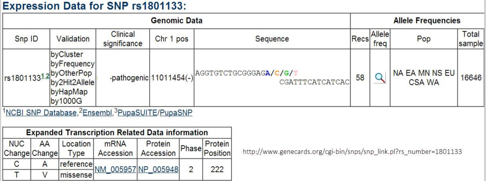
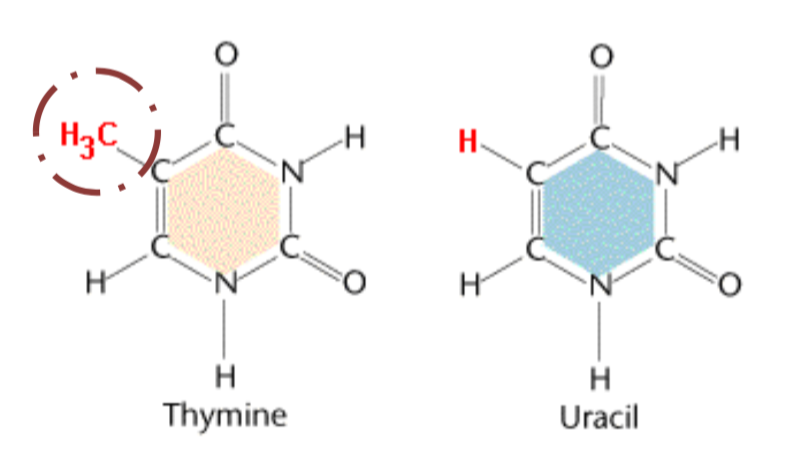
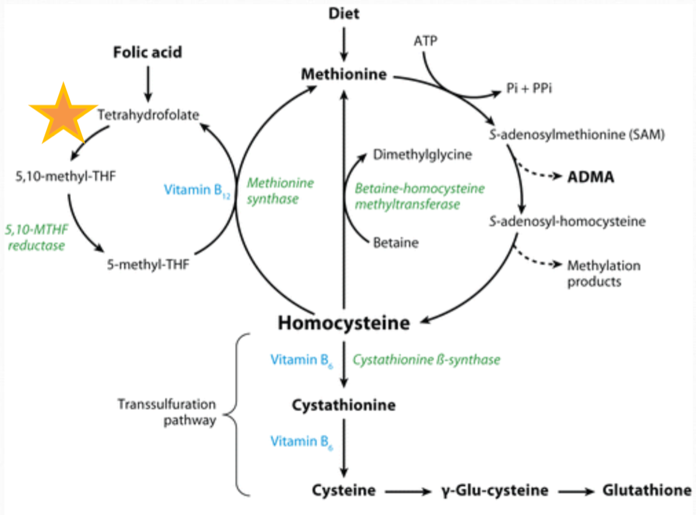
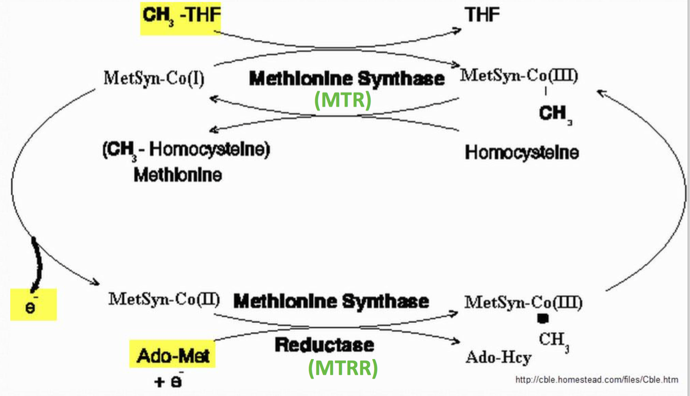
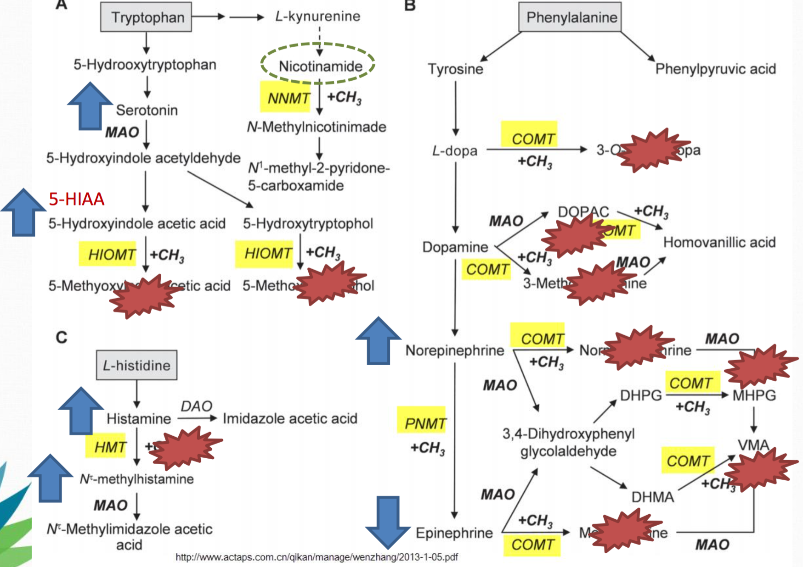

# refx methylation and clinical nutrigenomics

## 001 introduction

- everything leads to chronic inflammation
- genes, obesity, diet, early life stress, psychosocial stress, leaky gut, t-cell disfunction
- leads to many other chronic health issues

## 002 basic genetics

The presence (or absence) of genes is not the primary concern, but rather the epigenetic expression of those genes.  Everything in the environment can effect the epigenome and gene expression.

Methylation and DNA

- Uracil = RNA base
- Uracil when methylated becomes Methyl-Uracil --> Thymine
- Lack of methylation --> Uracil base incorporation into DNA __= BAD__
- DNA transcription has to stop and splice out uracil before continuing --> fragile, breakable DNA

Single nucleotide polymorphism (SNP)

- When a single nucleotide differs from the majority (wild type)
- SNPs vary in terms of severity and benefit due to: location, redundancy
- _Most_ SNPs do NOT govern genetic function and expression
- SNPs may decreased cofactor affinity
    - In the process of synethesizing a protein from DNA, the SNP may cause a different amino acid to be incorporated
    - The difference in enzyme shape can cause the protein not to bind as strongly to its associated cofactor
    - SNPs may be bypassed by increasing cofactor concentration and providing end products directly, such as bypass MTHFR by increasing riboflavin

MTHFR SNP example

- MTHFR C677T
- known by SNP number rs1801133, most common categorization
- C677T = location 677, should be a C, a T actually present
- 677TT = location 677, T is the bad one, a T actually present 
- all SNPs will have a nucleotide base change (C vs T or A vs G), may or may not have a corresponding protein change
- A222V = amino acid alanine switched to valine, protein position 222 (location unimportant)
- a change in amino acid affects the charge and shape of the enzyme, and its efficacy at binding to cofactors

Nuclear DNA

- Both paternal and maternal sets
- histones for protection, and repair mechanisms

Mitochondrial DNA

- Inherited only from maternal side
- Lack of histones = high rate of mtDNA mutagenesis (10x nDNA)
- Mitochondrial transcription factor A (TFAM) = Protective coating and regulation
- more mtDNA copies, better cell survival and function, more they can express ATP

## 003 what is methylation

Methylation is the addition of a methyl group, a single carbon group with three hydrogens, onto a compound.

Functions of methylation:

1. Turn on and off genes (gene regulation)
2. Process chemicals, endogenous and xenobiotic compounds (biotransformation)
3. Build neurotransmitters (norepinephrine -> epinephrine, serotonin -> melatonin)
4. Metabolize neurotransmitters (dopamine, epinephrine)
5. Process hormones (estrogen)
6. Build immune cells (T cells, NK cells)
7. DNA and Histone Synthesis (Thymine aka 5-methyluracil)
8. Produce energy (CoQ10, carnitine, creatine, ATP)
9. Produce protective coating on nerves (myelination)
10. Build and maintain cell membranes (phosphatidylcholine)

Methylation is often disturbed by the following:

1. Lack of cofactors/substrate driving methylation forward (zinc, B2, magnesium, cysteine, B6, methylcobalamin)
2. Medications (antacids, methotrexate, metformin, nitrous oxide)
3. Specific nutrients depleting methyl groups (high dose niacin)
4. Environmental toxicity, heavy metals, chemicals (acetylaldehyde, arsenic, mercury, high copper)
5. Excessive substrate (feedback inhibition – eg. DMG, SAMe, Methylfolate)
6. Genetic mutations/polymorphisms (MTHFR, GSTM1, PEMT, MAT, GAMT, CBS)
7. Mental state (stress, anxiety, lack of sleep)

You don't have to have a SNP for the function to be messed up.  Just because you have a SNP doesn't imply you have a deficiency.

This entire course studies a select few biochemical pathways, specifically the following 3:

1. Folate cycle (left)
2. Methionine-homocysteine cycle (right)
3. Transsulfuration pathway (bottom)

## 004 folate metabolism

Folate is the main regulator of methylation, and the best place to start looking and applying interventions.  Folate is actually a generic term for ~150 different forms of food folate + synthetic folic acid.  If you cook the plants, the folate is destroyed.

__Folic acid does NOT equal folate.__  Folic acid is only ONE type of folate. Folic acid is not found in nature.  One must be specific when discussing folate. Use the appropriate term and form.  Ask for clarification from labs.

All of these are considered forms of folate

- Folic acid
- Folinic acid (5-FormylTHF) 
- Methylfolate (5-MTHF)

Folic acid must undergo various transformations prior to utilization.  In order to do so the body requires: uncooked leafy greens, functioning enzymes, available receptors and transport across membrane, Vitamins B2/B6/B12 and an acidic gut environment.  When your body does not completely convert the folic acid present, it results in a novel substance, _unmetabolized folinic acid_, that has negative health consequences.  See slide 35 for more details.

The following genes affect aspects of folate metabolism (see slide 37 or <http://genecards.com> for more details).

FOLR 1,2,3 / SLC19A1 / ALDH1L1 / DHFR / MTHFS / MTHFD1 / SHMT 1,2 / MTHFR / TYMS

Low SAM = promoting MTHFR.  High SAM = inhibiting MTHFR.  SAM can fit in the binding site on the end of the MTHFR enzyme, and will block the expression of the the enzyme.  As SAM increases, the higher the likelihood it will sit there and block the binding site.

## 005 SHMT

SHMT is an enzyme that converts between serine and glyncine.  Incorrect function can lead to such issues as decreased glycine, which is a substrate for glutathion, leading to reduced glutathione.

You have 2 variants, SHMT1 resides in the cellular cytosol, while SHMT2 resides in the mitochondria.  The cofactors are B6 as P-5-P.  The endproducts are folinic acid, glycine and substrate for MTHFR.

SHMT has an important relation to cancer.  Inverse correlation between serum B6 and occurance of certain cancers.  B6 is very commonly deficient in diet, __especially in grain-free diets__.  If SHMT efficacy is inhibited, then even a "normal" serum level of B6 may be inadequate for that patient.  

Lab reports

Difficult to ascertain functional B6 levels.  Just because it's in the blood doesn't mean it's being used by the body.  Look at 5-formyl-THF (folinic acid) levels.  Look at glycine and serine levels.  Reference ranges don't really mean anything, often a sample of a sick population.

## 006 MTHFR

The MTHFR enzyme is functional with SNPs; albeit less so proportionately to the number of SNPs.  

MTHFR C667T:

- Significant reduction in enzyme stability.
- Increased FAD (Riboflavin) increases stability and thus function of enzyme
- Bypass by supplymenting with L-5-MTHF or 6S-5-MTHF endproducts
- MTHFR C677T Heterozygous = 40% loss of function 
- MTHFR C677T Homozygous = 75% loss of function

MTHFR A1298C

- Located at C-terminus end of gene
- Where SAM binds to regulatory region
- Conflicting studies
- Enzymatic reduction when combined with C677T
- MTHFR A1298C Heterozygous = 20% loss of function 
- MTHFR A1298C Homozygous = 40% loss of function

__MTHFR C677T & MTHFR A1298C Compound Heterozygous = 40% loss of function.__  MTHFR is very prevalent for Mexicans, Italians, Chinese.

Supplementing with folic acid or L-5-MTHF may be enough for younger healthier patients.  Almost certainly insufficient for older, more chronic disease patients.  Make sure to remove  all folic acid from diet.

It's ideal to review Nitric Oxide, B12, Homocysteine levels, Methylation Pathways, Oxidative Stress Levels and Thyroid before methylation but not required.

Possible Findings (may easily vary):

- Elevated B12
- Low to High Homocysteine 
- Low to High Folate (ensure only folic acid)
- High Nitrotyrosine
- Low SAM
- High SAH
- High Adenosine
- High Histamine
- Low Active Folate (RBC)
- Low 5-MTHF
- Low THF
- Segmented Neutrophils

Homocysteine metabolism

- MTR/MTRR uses B12 and MTHF to recycle homocysteine into methionine
- BHMT to recycle homocysteine into methionine (mainly in the liver and kidneys) via TMG or betaine-Hcl
- CBS is the only route to eliminate.  most SNPs inhibit the CBS enzyme and slow down the clearing of homocysteine.  you can supplement with B6 to aid to some degree.

## 007 folic acid vs reduced folates

Folate-binding proteins will bind preferencially to folic acid, at the expense of reduced folates, such as folinic acid or MTHF.  Reduced folates are what your body needs, so just give them that directly.  Methyltetrahydrofolate increases plasma folate more effectively than folic acid in women with the homozygous or wild-type 677C -> polymorphism.

Additionally, unmetabolized folic acid can lead to cancer.

FOLR1 and FOLR3 are adult folate receptors.  They bind folic acid and reduced folates and transports 5-MTHF into cells.  FOLR2 is a placental and fetal folate receptor.  Highest for Folic Acid and less for Reduced Folates.  Folic acid supplementation does not reduce intracellular homocysteine and may disturb intracellular methylation.

MTHFR in important in neurotransmitter formation and reduced activity may cause: Depression, Insomnia, Bipolar, Anxiety, Erectile Dysfunction and Thyroid Disorders.

Methylfolate and SAMe are precursors to tetrahydrobiopterin (BH4).  BH4 is a necessary first step in the conversion of many neural transmitters, including the conversion of tyrosine to dopamine and norepinephrine as well as l-tryptophan to 5-HTP and serotonin.  Without supplementation, a C677T SNP will almost certainly lead to reduced conversion of all of these from BH4 deficiency.

Supplementing with MTHF might not be sufficient.  Deficiencies in cofactors such as Vitamin C for dopamine -> norepinephrine, P-5-P for 5-HTP -> serotonin, and substrates such as phenylalanine and tryptophan can reduce function as well.

__Don't increase BH4 until inflammation and oxidative stress is reduced.__  If oxidative stress is present, you won't make neurotransmitters and will produce oxidized BH2.

On the other hand, vitamin C is a cofactor in converting dopamine to norepinephrine.  If you're low dopamine and supplementing with vitamin C, you're accelerating the conversion away from dopamine.

Nitrotyrosine is a byproduct of incorrectly functioning nitric oxide.  It's bad.  You need to supplement with MTHF to reduce it.

Many common drugs to avoid with MTHFR.  Look at slide 95 or get _Herb, Nutrient, and Drug Interactions_.

## 008 thyroid and mthfr

[Flavin adenine dinucleotide (FAD)][FAD] is one of the major cofactor for MTHFR.  Ribonflavin (vitamin B2) is converted to FAD by thyroxin (also known as T4).  

[FAD]: https://en.wikipedia.org/wiki/Flavin_adenine_dinucleotide

Thyroid deficiencies can further exacerbate MTHFR problems.  Even if your MTHFR is normal, you can have MTHFR issues from reduced thyroid function.

MTHFR SNP implies a reduced afinity of riboflavin to the MTHFR enzyme -- it doesn't bind as well.  

>   “In conclusion, the present study indicates that thyroid status affects the phenotypic expression of the MTHFR 677CT polymorphism by modifying FAD synthesis. This mechanism could partly explain how thyroid dysfunction affects the metabolism of folates and homocysteine.”

Significant relationship between MTHFR deficiency and cardiovascular issues.

MTHFR is at the cornerstone of SAM production.  SAM is your main DNA regulator -- it supports [DNA methyltransferase][dna methyltf], aka DNA methylation, especially forms 1 & 3.  If you're not stabilizing DNA methylation, you will have increased likelihood of cancer.

[dna methyltf]: https://en.wikipedia.org/wiki/DNA_methyltransferase

Folate mediates 1-carbon synthesis.  SHMT and folicinic acid are necessary to create your DNA nucleobases.  You need to keep creating nucleobases in order to keep up ongoing cellular division.  Insufficient support will yield copy errors in DNA replication and increase likelihood of cancer down the road.

Homozygous 677 increases thyroid, gastric, colon cancer.

## Q&A

B6 is necessary to support SHMT.

Nicotinic acid for niacin supplementation (when needed).  The niacine promotes NAD.  It sucks up methyl donors and lowers SAMe.  The nicotinic acid supports mitochondria. 

You can be vegan for several yours and not be B12 deficient because you can store it in your bile.  However, if you're doing colonics or enemas, you will cleanse your bile and be B12 and folate deficient.

## 009 mtr and mtrr

MTR is the driver of the methionine cycle, used it meets the methylation cycle.  5-methylfolate intersects with B12 to drive the methionine cycle.  

Only 2 nutrients, 5-methylfolate and cobalamin/B12, but many genes controlling aspects of the cycle.

The function of mtr is to recycle homocysteine back into methionine in order to produce SAM: the major methyl donor.  Requires B12, zinc and riboflavin to function.  Takes the methyl group from methyl-cobalamin and attaches it to homocysteine, and methyl-homocysteine is also known as methionine.  Cycle continues and donates the methyl group to SAM.  Eventually comes back around and converts back into homocysteine.  

MTRR recycles the cobalabine.  Methylfolate donates a methyl group to re-methylate the cobalamine, and in the process becomes tetra-hydrolfolate, and restarts the folate cycle.

AdoMet is another term for SAM.  All you need to know is you need methyl-B12, you need methylfolate, you need SAM and you need low oxidative stress.

Methyl trapping meants that both methylfolate and methyl-B12 have methyl groups that they are unable to donate.  The methyl groups are trapped and unable to be transferred to Hcy to SAM.  Bad enough that your can't produce SAMe but can also produce excessive oxidised forms.

Methionine synthase links oxidative stress to epigenetic regulation.  Compare the left and right sides of the system and the problems that happen with oxidative stress on the left.

![methionine_synthase]

[methionine_synthase]: refx_methylation_nutrigenomics/page_111_of_296.png width=550px

MTR/MTRR inhibition by __acetylaldehyde__.  Both a metabolite of ethanol metabolism and released from candida.  Solution: limit alcohol / sugar ingestion, treat candida overgrowth and support detox symptoms.  Also, alcohol is a terrible mitochondrial toxin.

Nitric oxide can also inhibit MTR/MTRR.  Excessive use of methylfolate is possible.  Nitric oxide can be prevalent in chronic disease cases.  Giving methylfolate to those patients can further elevate nitric oxide causing symptoms to get worse.

If there is MTR/MTRR inhibition, you can use the compensation/shortcut betaine-homocysteine methyltransferase (BHMT) pathway.  But be careful because it can put the long pathway out of wark.  As BHMT upregulates in the liver/kidney, B12 and folate go from normal to high due to methyl trapping.  It will also burn through lots of betaine and choline.  Lastly, homocysteine may elevate from subsequent steps not functioning as well as they shuold.

In time, it can decrease SAM production.  The Methyltransferases will slow, including: creatine, phosphatidylcholine, glycine, sarcosine, carnitine, CoQ10.  Cell membrane damage and oxidate stress will increase.

Lab notes:

An excess of S-adenosyl-homocystein (SAH) is very problematic.  If SAH builds up to excessive levels it can shut down some 200-odd methyl-transferase-related enzymes in the body.  SAM/SAH ratio is the principle clinical marker of methylation in the body.

If you see elevated B12 levels on a lab test, it may be because MTR can't do it's job or you're deficient in methylfolate.  Absortion isn't enough.  Those with digestive disorders may not absorb or transport either nutrient well.  Need to be able to utilize those nutrients.

Anything lower than 6 or 7 fasting homocysteine is insufficient.  After the blood draw, the red blood cells will continue producing homocysteine.  Sample needs to be spun down or put on ice to stop.

## 009.1 q&a

If you see your patient getting worse from too much Vitamin C, maybe their dopamine is dropping.

What about indicators of oxidative stress in me?

- tired/fatigued
- elevated super oxide dysmutase
- elevated free radicals
- elevated nitrotyrosine

## 010 mthfr treatment

Need to help reduce nitric oxide synthase (NOS).  Nitric oxide (NO) may inhibit MTR/MTRR, especially if they're B12 deficient.  Excess NO will inhibit tetrahydrobiopterin (BH4).

QUESTION: what are my nitric oxide levels?

Histamine issues

Extracellular histamine
- DAO with copper and calcium
- --> Imidazole acetylaldehyde + H202 + NH4 
- --> ? + NAD
- --> NADH + 4-Imidazoleacetate

Excess methylfolate may backfire.  Inhibiting methionine synthase and transsulfuration pathways due to excessive nitric oxide production.

### methylfolate: How much to give?

Evaluate Signs and Symptoms.  Check labs for: 23andMe (COMT, MAOA, GAD), methylation Pathways, nitric oxide, citrulline, nitrotyrosine, biopterin levels.

Inform patient to take methylfolate when they feel it is needed. They will learn the signs and symptoms. After they improve, dose will alter significantly. Prepare them for this.  Have niacin and hydroxocobalamin on hand always.

### mthfr and maoa, comt, gad

- Support MAOA, COMT, GAD First – Even in absence of SNPS!
- Balance NO levels with hydroxocobalamin and possibly niacin
- Optimize magnesium and B6 levels for COMT and GAD
- Optimize riboflavin levels for MAOA
- Support estrogen metabolism for COMT (probiotics/liver support/sulfonation)
- Reduce oxidative stress (in those not fighting pathogens)
- Support sulfonation – if tolerated. (NAC, MSM, molybdenum)
- Reduce catechol-containing foods and flavonoids for COMT ([quercetin][], potatoes, green tea, coffee can slow COMT down)
- Avoid [tyramine-containing foods][tyramine foods] (aged, pickled, spoiled foods) for MAOA
- Support adrenals and reduce catecholamine rushes (ashwagandha, B5, meditation, exercise)
- Nighttime sleep support (GABA, magnesium, B6, niacin)
- Add in methylfolate and appropriate cobalamin prn – taper up

[quercetin]: https://en.wikipedia.org/wiki/Quercetin
[tyramine foods]: http://www.mc.vanderbilt.edu/documents/neurology/files/Tyramine%20Menu%20Book%2006227101.pdf

QUESTION: what do I know about my mitochondrial levels?
QUESTION: should I stop taking seratonin supplements to see my normal 5-hydroxyindoleacetate levels?

Everything highlight in yellow is a methytransferase.  Having insufficient methyl groups to donate will shut down all those enzyme reactions.

This chart explains why you take niacin if you're feeling depressed and why you take additional methyfolate if you're feeling too stimulated/aggitated.

### nitrous oxide and mthfr and mtr

Nitrous oxide inhibits MTR enzyme.  Oxidizes B12 and inhibits methionine synthase.

Those with MTHFR and methylation defects already have limited MTR enzyme function so further reducing it may cause significant neurological or cardiovascular damage.

###  methionine synthase optimization summary

Use Appropriate Forms of Cytosolic B12 (in terms of NO levels):  
- Methylcobalamin OR Hydroxocobalamin OR Adenosylcobalamin

Glutathione & SOD/Catalase is needed to reduce oxidative stress on Cobalamins  
- Methionine synthase enzyme functions in low oxidative stress environments

Methylfolate and SAM needed to reduce Cb(I) \\(\rightarrow\\) Cb(III)

Nitric Oxide production in balance

Pathogens, Alcohol, Medications, Heavy Metals, Candida and Xenobiotics removed

## 010.1 q&a

QUESTION: could I be supplementing more glycene for glutathione production?  either dietary or supplementary?

## 011 sam production and utilization

>   SAM, a remarkably versatile molecule, is said to be second, only to ATP, in the number of enzymes that require it.

