# refx multi-arm bandits

## summary

- economics of running an experiment in an online service are different thana manufacturing or agriculture
- costs have shifted from production to opportunity cost
- multi-arm bandits minimize the opportunity cost of running an experiment
- explicitly minimizing cost is hard, but a simple Bayesian heuristic know as Thompson sampling produces good outcomes

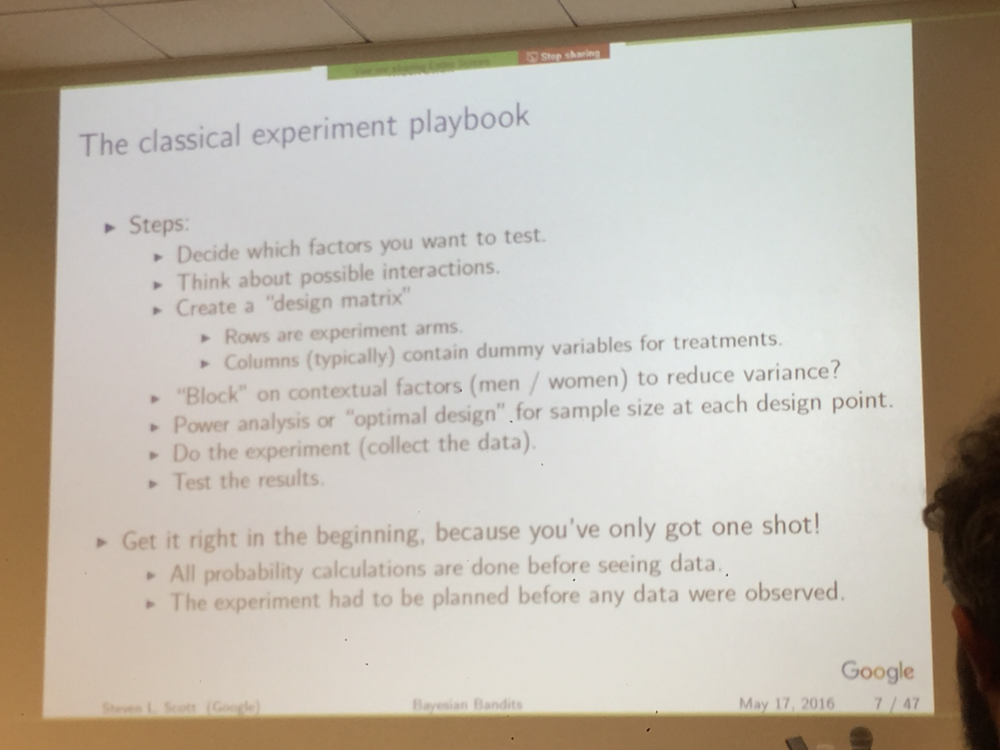

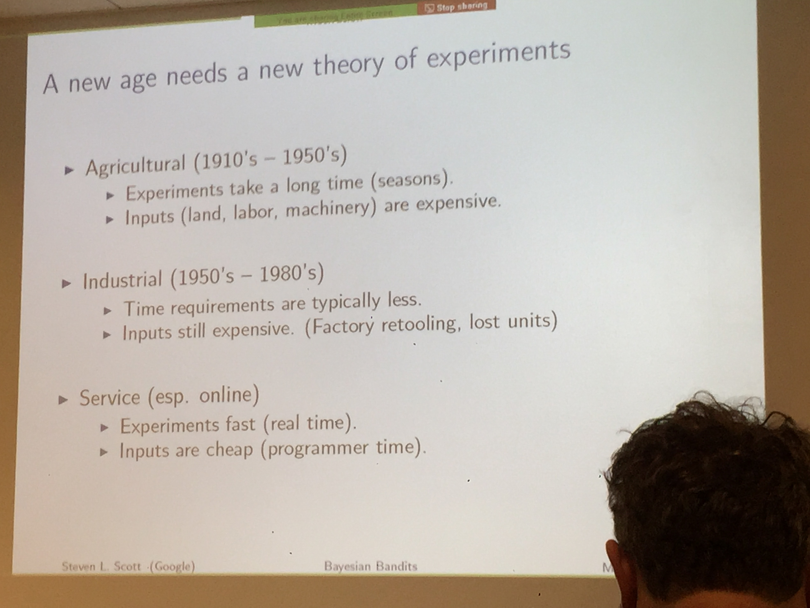

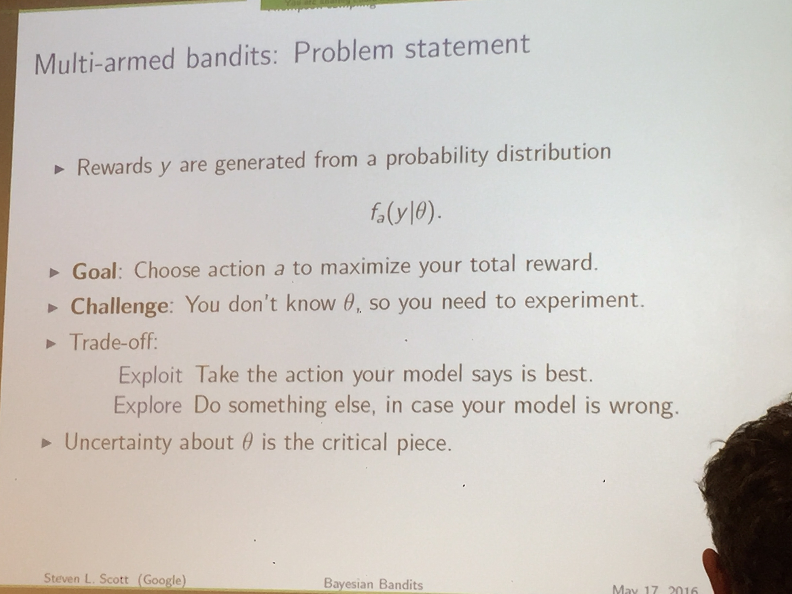

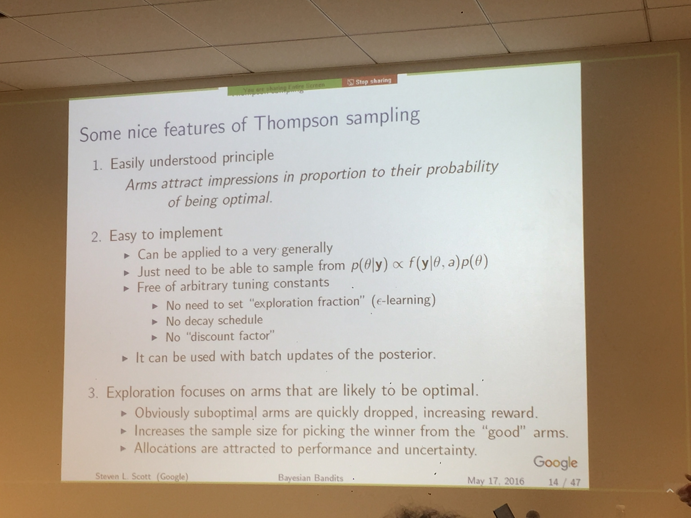

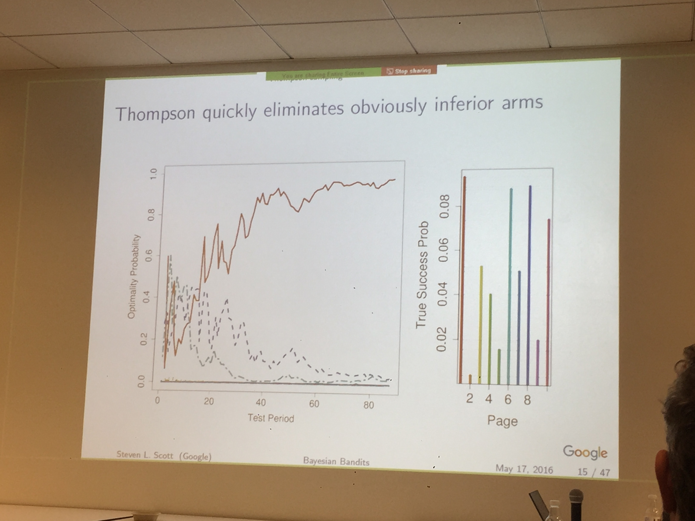

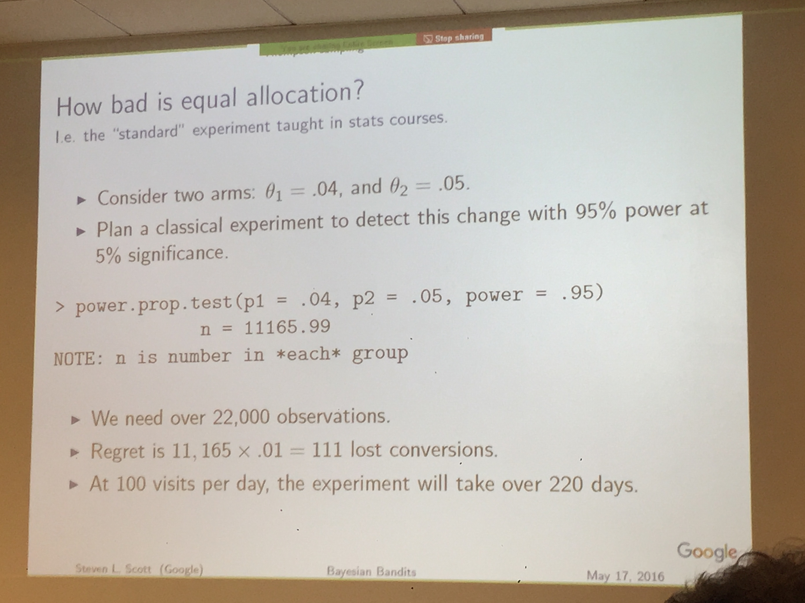

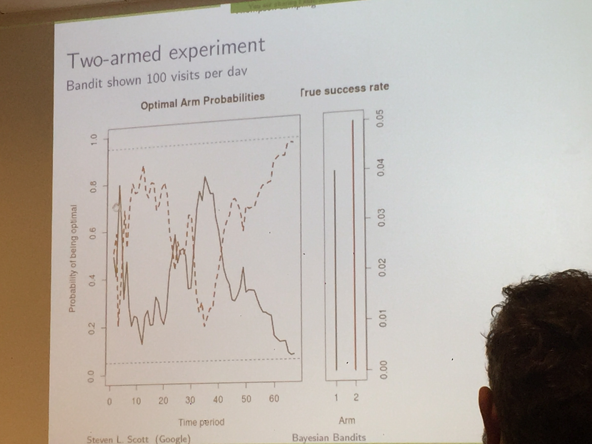

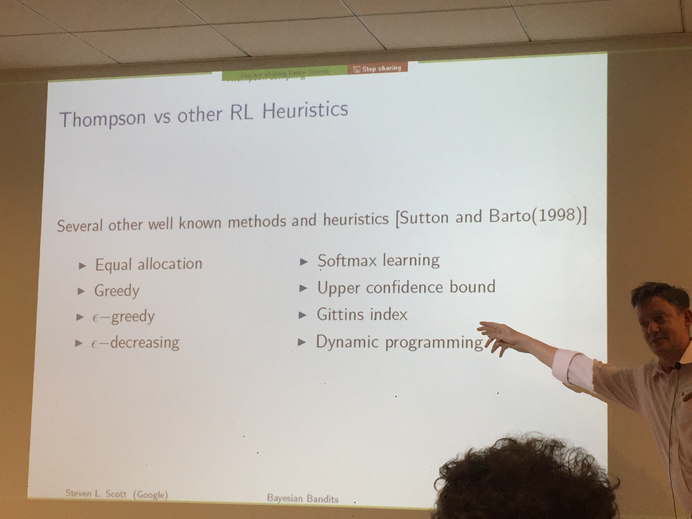

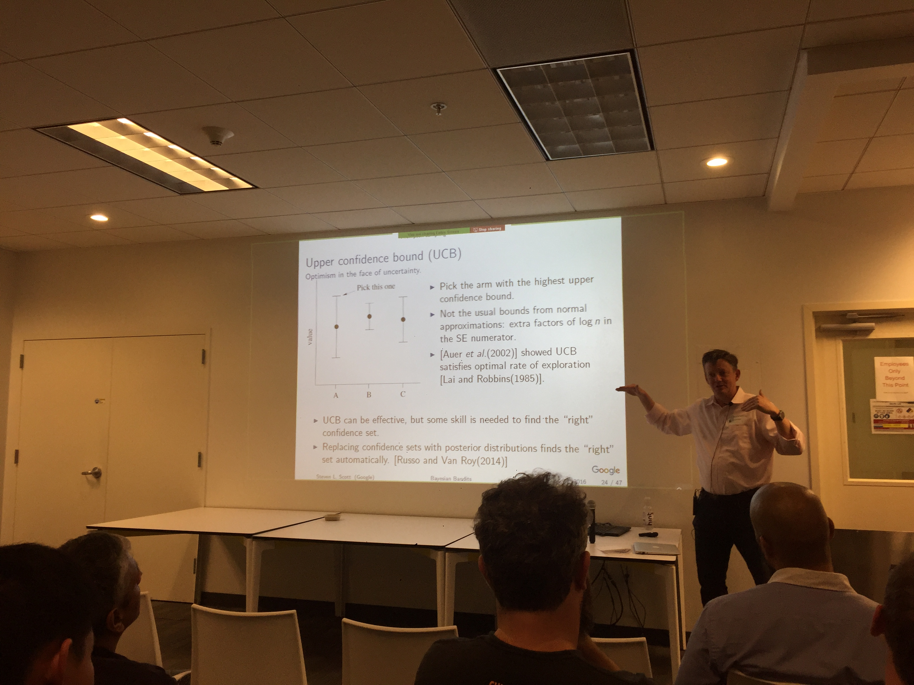

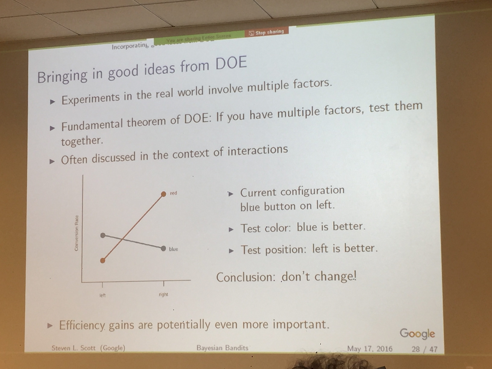

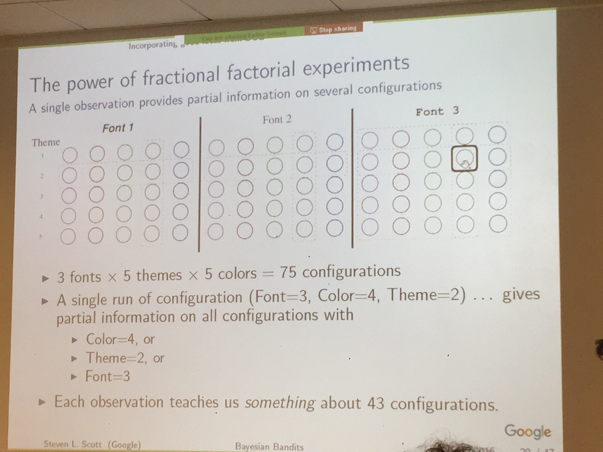

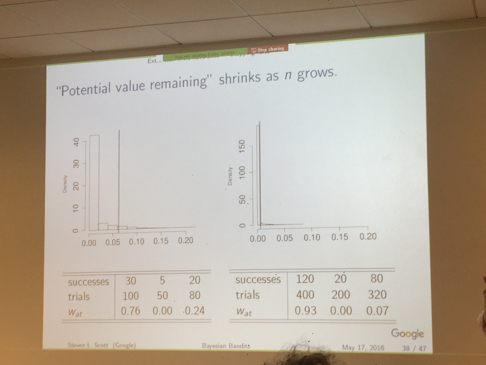

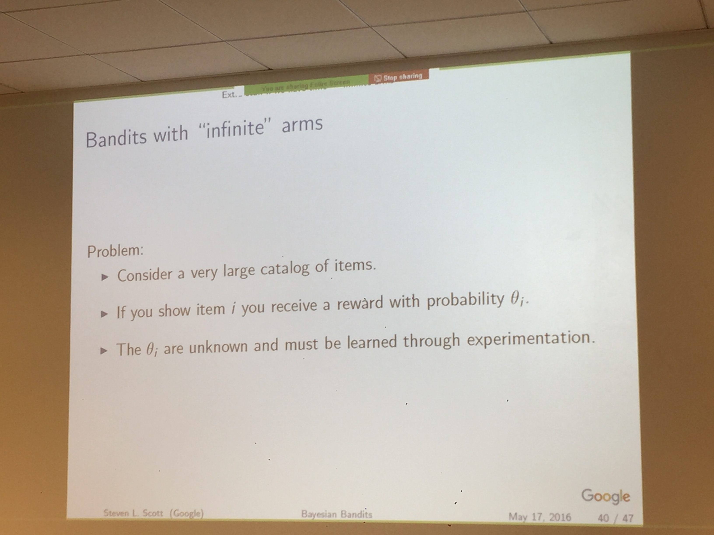

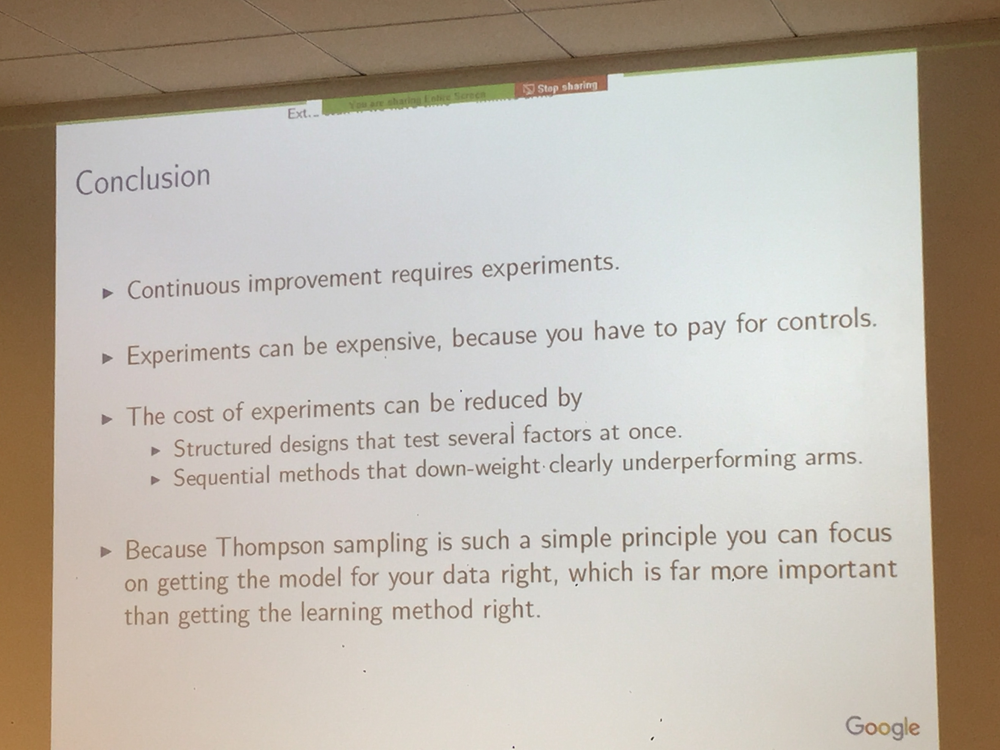