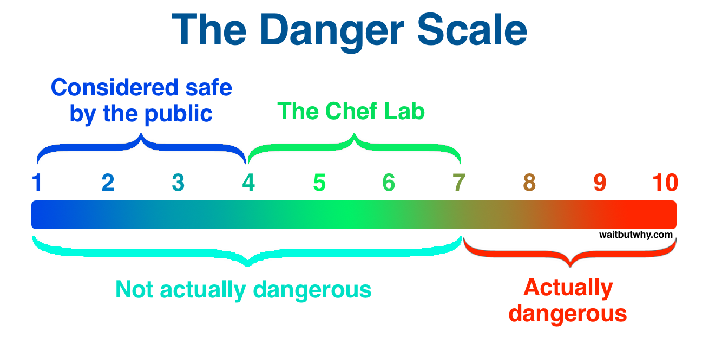

# refx the cook and the chef

The box represents the current hypothesis.  The circle represents a new source of information that can be used to adjust the hypotheses.

The circles are the bosses, not the boxes.

Goal formation below.
Goal attainment above.  $\leftarrow$ laser focus

The goal pool is just the overlap of want and reality boxes.  If they change shape, so does the goal pool.  Keeping up with this requires regular macro-scale reflection on whether your current goal is still the best in the goal pool.

## Filling the want box

Dig deep into important/trivial, valuable/frivolous
Figure out what you respect/distain, what fascinates/bores you, what excites you

The limiting factor is engineering
Without engineering, you run out of data with which to do science

Think very hard about first principles
"What is the everyday thing that is the most ludicrous when inspected with new eyes?"

Musk had 5 areas he thought would most affect humanity and he wanted to reach into those areas with advanced technology.  Interesting things, for him, involved engineering, in an area important to the future and involved cutting-edge technology.

## Managing your own software

>   Non-creative behavior is learned.
>
>   -- George Land

One of the highest value thigns you can do is to constantly be updating your own mental software.  Regularly evaluate what you want and what is possible from first principles.  And test it constantly.

Unless we are incredibly dilligent, we end up accepting programming handed down to use without questioning it.  At best it's a generation out of date.

__Dogma:__ a whole lot of convictions not based on real-worth data.  "X is true because [authority] says so."

>   Few people are capable of expressing with equanimity opinions which differ from the prejudices of their social environment.  Most people are even incapable of forming such opinions.
>
>   -- Einstein

## The cook and the chef

The difference between the thinking of Musk and that of normal people is the difference between a trailblazing chef and line cook.  One invents.  The other copies.  There is a spectrum of cook, but they all start with something that already exists.

__In some situations, your autopilot won't suffice.__

Create.  Or copy.

Create.  From first principles.  Ala Feynmann.  And deep practice.

Don't default to conventional wisdom.

Most people assume they more chef-like than they actually are.  To impress your tribe you must subscribe to the beliefs of that tribe enough to consider the goal worth obtaining.  Considering ourselves chefs is the biggest mistake.

The real leader of cooks is the cookbook.

If we don't consider a large enough view, we miss flaws in our thinking.

Being a chef is understanding the difference between brain hardware and software and tirelessly upgrading the latter.  Missing that misses understanding the game being played.

The visionary nature of the chef isn't from seeing the future, it's from seeing today without the mental baggage of outdated thinking.

*TRENT NOTE: I've done this to a very small degree with my health.  How do I continue to push further in other areas?*

Ways we mistake our cook-like thinking for independent reasoning and chef-like thinking for magical ability:

- We mistake the chef's clear view of the present for vision of the future
- We mistake the chef's accurate understanding of risk for courage[^fn-company]
- We mistake the chef's originality for brilliant ingenuity.  Following first principle thinking to it's logical conclusion often looks like genius.  __The main ability is not to copy.__

[^fn-company]: Starting a company may be a bold move, but it isn't actually dangerous.  What's the worst that can happen?

What's the deal with us?  Why are we so scared and cook-like?

We need 3 major realizations to snap out of it:

## You don't know shit

Don't be a victim of your own certainty.  All the answers you have are wrong unless you've truly reasoned back to first principles.

Know and accept that your lack knowledge.

>   "You should take the approach that you're wrong.  Your goal is to be less wrong."

Play the equivalent of the why game.  Keep going back until you're sure there's no "because X said so..."

When there's proof-level certainty there's either some serious and concrete verified data under it---or it's faith-based dogma.  Remember even gravity isn't a proof.

The first epiphany is about humility.

## No one else knows shit either

Take the story of the emperor's new clothes.

"This doesn't seem right to me but everyone else says it's right so it must be right and I'll just pretend I also think it's right so no one realizes I'm stupid."

"Everything around you that you call life was made u pby people that were no smarter than you.  And you can change it."

Easy message to understand.
Hard message to believe.
Even harder one to act on.

The delusion about the wisdom around us, society as a whole, runs much deeper than the delusion about ourselves.  We need to figure out how to lose respect for the general public.

Leverage the analogy of places you have been chef-like to remind yourslf.  In my case, consider diet and nutrition.  Everyone is doing a more shit job than I am.  Why wouldn't it be the case in other parts of my life.

## You're playing grand theft life

We're finally in the lab, but something's holding us back.  Why?

There are 4 kinds of people:

1. __Proud cook.__ Someone fully drinking the dogma kool-aid.  Dogma is truth.  Full stop.  He actually sees the emperor's clothes.
2. __Insecure cook.__ Proud cook after Epiphany #1.  They realize they don't know shit.  They fail to realize know one else knows more and succumb to imposter syndrome.
3. __Self-loathing cook.__ Insecure cook after Epiphany #2.  He sees that it's all a big farse and know one knows anything.  Yet he can't mak a move and act on it.  He's afraid.
4. __The Chef.__ The self-loathing cook without the irrational fear.  Goes through the same process as #3 but isn't afraid to act on it.

$$+humility + confidence - fear$$

The difference between #3 and the chef is how they view negative feedback.  You must be truly comfortable with treating everything as an experiment with no negative connotations for not achieving the result you expected.  Failure is not an option, because we choose to view it as learning.

There's no more relabile corollary than super-successful people thinking failure is awesome.

Science is about disproving hypotheses.  Failure is part of the process.  We learn primarily thorugh failure.  

But we fail to act for 2 reasons

### 1. Misplaced fear

Talk of us irrationally being afraid of consequences.  Consider this:

Chef lab is 80% of the wins.
With 20% of the competition.

### 2. Misplaced identity

The self-loathing cooking can't grasp that he's the scientist, not teh experiment.  Everything you give a try, society considers that you've branded yourself with that thing.  They simplify to placing you in a clearly-labeled box.

People get confuse when you change, because they're forced to confront their blindly-chosen beliefs, so attempts to change are met with opposition, mockery and anger.

When it's hard to change, you become attached to your current identity. You forget that this identity and all its associate activities are just an experiment.

Scientists love negative feedback.  But when you identify as the experiment, negative feedback isn't helpful---it's an insult.

__Change is incredibly hard when you're trapped in your own history.__

To surpass this stage you have to figure out how to lose respect for your own fear.  The only way to weaken it is to defy it and observe nothing truly bad happens.  You must press outside your comfort zone.

Remove fear and concern with identity or the opinion of others.

Be more humble about what we know.
Be more confident about what's possible.
Be less afraid of things that don't matter.

Reasoning is a skill, and the more you do it the better you get.

Remember the chef/cook distinction and where you are on the spectrum.

__Ask "what's really going on here?"__